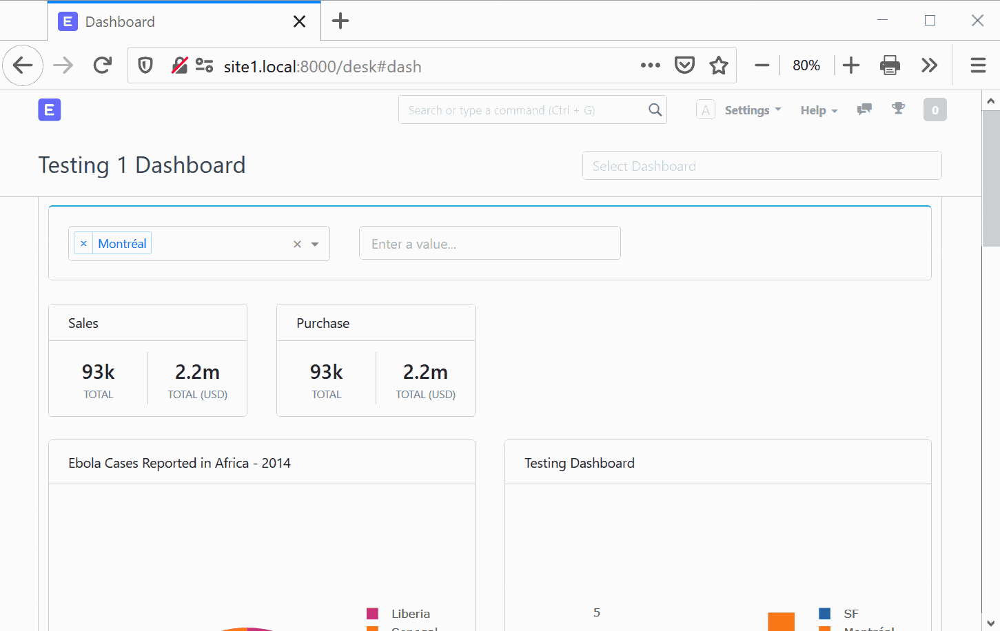
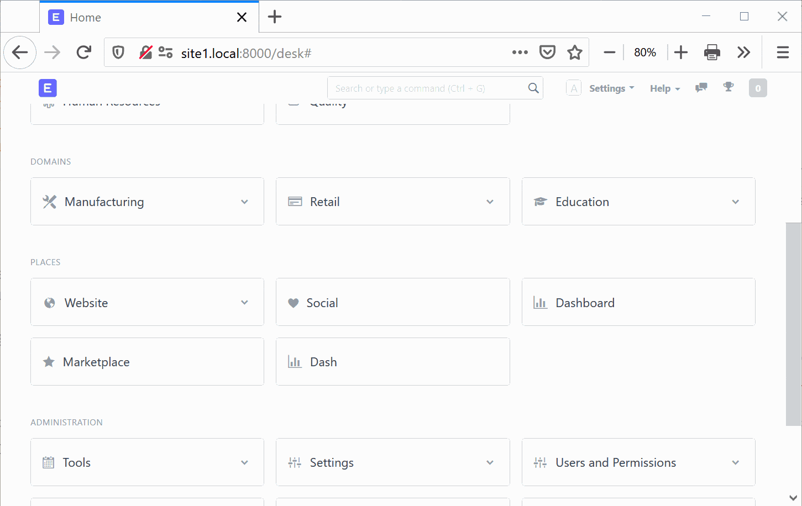
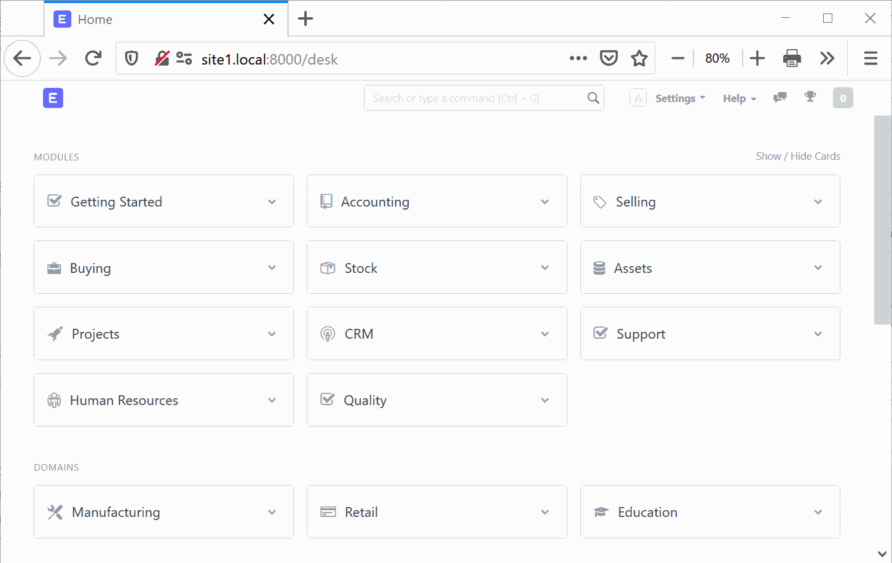

## [Plotly Dash](https://github.com/plotly/dash) integration for [Frappe web framework](https://github.com/frappe/frappe).

Plotly Dash is great dashboard tools which allow programmer to easily create interactive dashboard with endless possibilities but it lack of general functionality such as web-authentication and user permission.

Frappe web framework is also a great web framework with come with alot of functionality.

Integrate Plotly Dash with Frappe web framework will result in great dashboard tools with web-authentication, user permission, ability to easily performs CRUD operation and also the most important thing ERPNext.

### Feature

 - Access Frappe data from dash environment.

 - Dashboard template using CoreUI admin template.
 

 - Authentication from Frappe web framework.
 

 - Dashboard permission using user roles from Frappe.
 

### Description

#### How it works

It works by passing request from Frappe application to Dash application only if request url path start with `/dash`.

Then we embedded Dash page with CoreUI template into Frappe page using iFrame.

### How to use

Dash Integration app is design to use along with [Dash Dashboard](https://github.com/pipech/frappe-plotly-dash-dashboard) app.

#### Installation

    bench get-app dash_integration https://github.com/pipech/frappe-plotly-dash.git
    bench get-app dash_dashboard https://github.com/pipech/frappe-plotly-dash-dashboard.git

#### Adding dashboard

 1. Adding dashboard layout to `dash_dashboard/dash_dashboard` folder
 1. Set route in `dash_dashboard/router.py` file by adding route into `dashboard_route.route_wrapper` function
 1. Set callback in `dash_dashboard/router.py` file by adding callback into `dashboard_callback.callback_wrapper` function
 1. In Frappe web ui search for `Dash Dashboard` DocType, then add a new doc with matching name to `dashboard_route`

### Setup

#### For production setup

Change supervisor config
 - For [Normal setup](https://frappe.io/docs/user/en/bench/guides/setup-production.html) it's located on `/etc/supervisor/conf.d/frappe-bench.conf`
 - For [ERPNext Docker Debian setup](https://github.com/pipech/erpnext-docker-debian) it's locate on [`production_setup/conf/frappe-docker-conf/supervisor.conf`](https://github.com/pipech/erpnext-docker-debian/blob/master/production_setup/conf/frappe-docker-conf/supervisor.conf)

From

    command=/home/frappe/bench/env/bin/gunicorn -b 0.0.0.0:8000 -w 4 -t 120 frappe.app:application --preload

To

    command=/home/frappe/bench/env/bin/gunicorn -b 0.0.0.0:8000 -w 4 -t 120 dash_integration.app:application --preload

#### For development setup

    bench execute dash_integration.app.serve

### Limitation

 - We use [ResizeObserver](https://developer.mozilla.org/en-US/docs/Web/API/ResizeObserver) for iFrame resizing, it compatible for most of the browser but not all. Check compatibility at [CanIUse](https://caniuse.com/#feat=resizeobserver).

### Attribution 

 - [CoreUi Bootstrap Admin Template](https://github.com/coreui/coreui-free-bootstrap-admin-template/) - MIT License

### License

This repository has been released under the MIT License.
